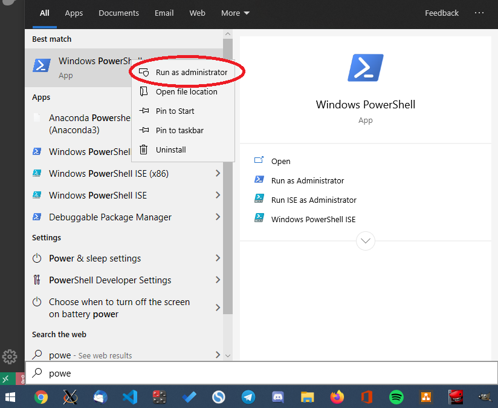
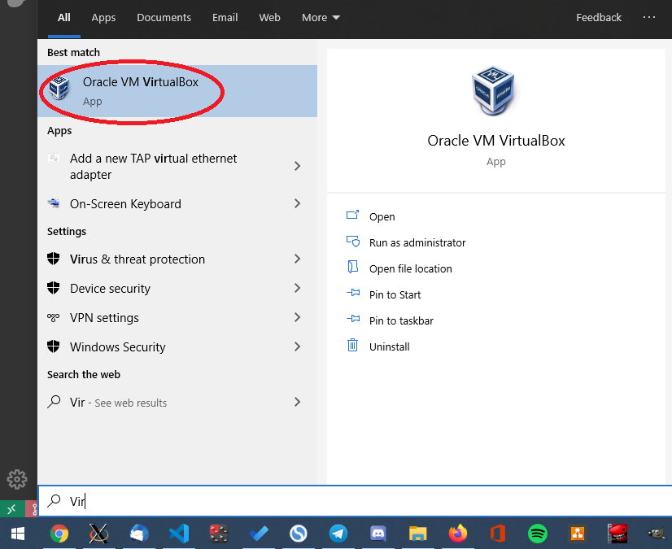
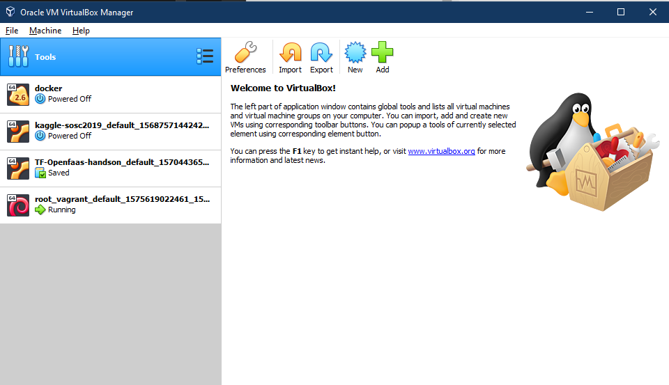
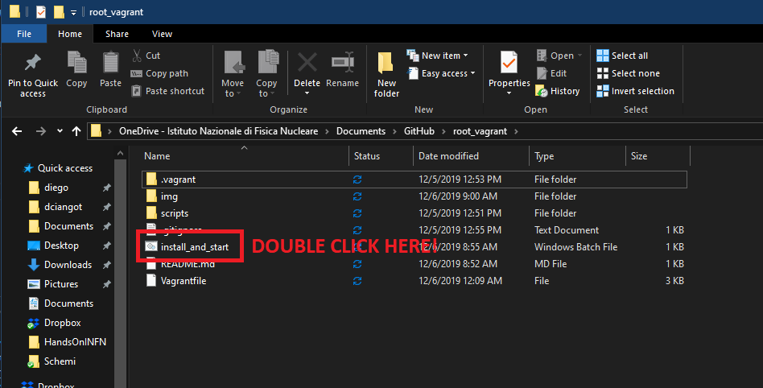
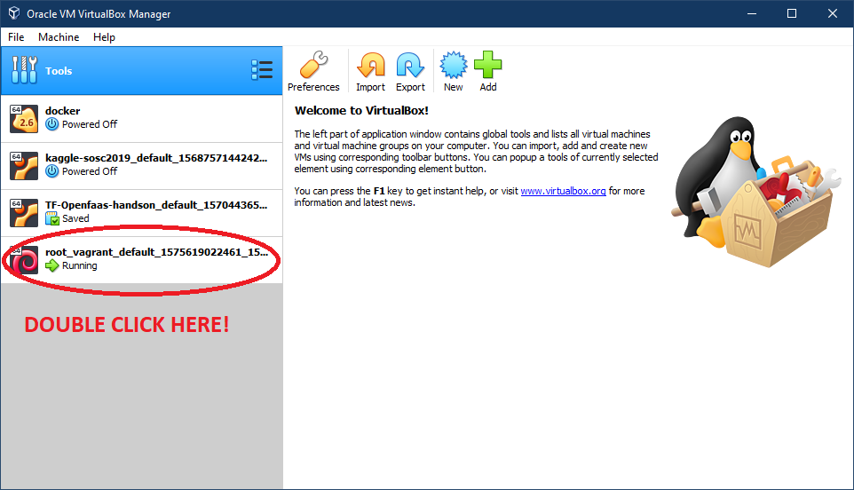

# Setup a virtual machine with g++ and ROOT

## On Windows 10

You wiil need to install VirtualBox and Vagrant. Instructions below.

### Install VirtualBox

Press Window button and then type power. You should see `Windows PowerShell` program appearing. Then right click on it and select `Run as administrator` as in the following figure:



This will open a terminal, you have to insert the command below and to press enter:

```
Disable-WindowsOptionalFeature -Online -FeatureName Microsoft-Hyper-V-All
```

When done, just reboot your PC.

Now download VirtualBox installation executable [here](https://download.virtualbox.org/virtualbox/6.0.10/VirtualBox-6.0.10-132072-Win.exe). Double click on it and follow the instructions.

Finally you should be able to open the VirtualBox control panel, pressing the window button and then typing VirtualBox. When you see the correct icon as below just click on it.



If everything went well you should see something like the following:



### Install Vagrant

Download the executable [here](https://releases.hashicorp.com/vagrant/2.2.6/vagrant_2.2.6_x86_64.msi) and double click on it to install.

Follow the instructions and you are ready for the following step.


### Install the VM

Download the zip file of repository [here](https://github.com/dciangot/root_vagrant/archive/master.zip)

Unzip the content wherever you like (instruction [here](https://www.aranzulla.it/come-estrarre-file-zip-24541.html?fabm=file)).

Then open the extracted folder and double click on the file called `install_and_start.bat`. This wiil install the virtual machineadn it will take a while, depending on you internet connection


At the end of the process you should be able to find your machine on the VirtualBox control panel and to open it in a window just double clicking on it as below:


Enjoy your VM! Your username for the machine is `vagrant` and you password the same (`vagrant`)

### If your VM does not start

This is probably due to BIOS configuration of your PC.
Try solution 1 first here: https://ivanderevianko.com/2015/06/fix-vt-x-is-not-available-verr_vmx_no_vmx-in-virtualbox
If it does not work try the solution 2.
